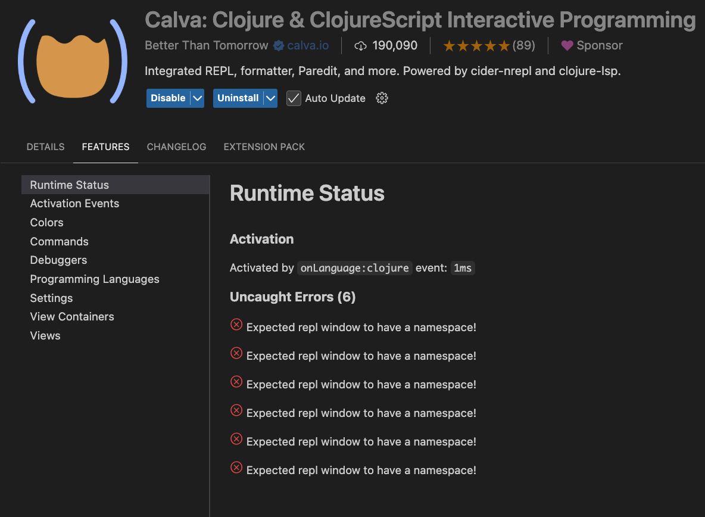

# Debugging repository
This mini repository has been setup to help clojure Calva development by reproducing an issue: [REPL fails to connect #2806](https://github.com/BetterThanTomorrow/calva/issues/2806)

## Steps to reproduce:
1. Clone repository in command line
2. cd `<path to repo>`
3. run `clojure -M:test:frontend:dev` in command line
4. Open the project directory with calva compatible editor
5. run calva command `Calva: Connect to running REPL server in the project`
6. select shadow-cljs

**Expected:**
Connection succeeds

**Actual:**
Connection fails with
```
; Connecting using "shadow-cljs" project type.
; You can make Calva auto-select this.
;   - See https://calva.io/connect-sequences/
; 
; Connecting ...
; Reading port file: file:///Users/tommimartin/Projects/calva-test/.shadow-cljs/nrepl.port ...
; Using host:port localhost:7000 ...
; Hooking up nREPL sessions ...
; Failed connecting.
; nREPL Connection was closed
```

Calva extension reports: 


## Reproduced with

### macOS Sonoma - Cursor IDE
- macOS Sonoma 14.6.1
  - Cursor IDE 0.49.6 
  - Calva 2.0.504

IDE version details in full:
```
Version: 0.49.6
VSCode Version: 1.96.2
Commit: 0781e811de386a0c5bcb07ceb259df8ff8246a50
Date: 2025-04-25T05:07:16.071Z
Electron: 34.3.4
Chromium: 132.0.6834.210
Node.js: 20.18.3
V8: 13.2.152.41-electron.0
OS: Darwin arm64 23.6.0
```
